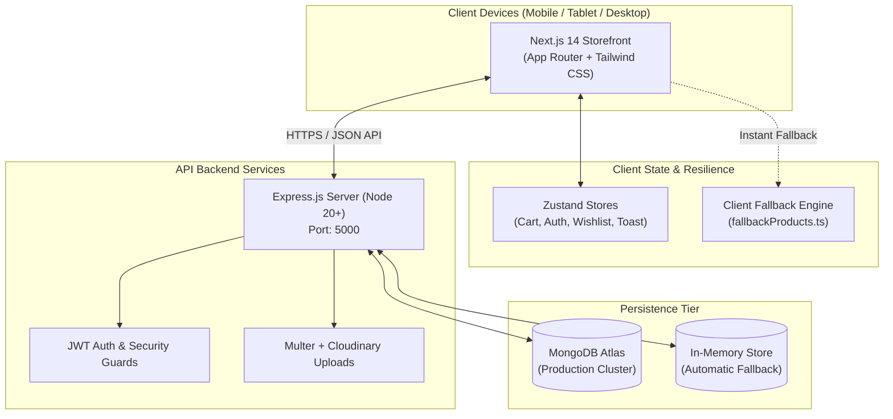

<div align="center">

# 🦋 BUTTERFLY CARE — *for every mom*
### A Premium, Elegant & Intuitive Baby & Mother Care E-Commerce Platform

[](https://butterfly-care-e-commerce-website.vercel.app)
[](https://nextjs.org/)
[](https://reactjs.org/)
[](https://www.typescriptlang.org/)
[](https://tailwindcss.com/)
[](https://nodejs.org/)
[](https://expressjs.com/)
[](https://www.mongodb.com/)
[](https://www.docker.com/)
[](https://wa.me/94740225855)

<br />

> **"Everything you need for you and your little one."**  
> An ultra-fast, aesthetically soothing e-commerce boutique carefully crafted for mothers, infants, and growing families across Sri Lanka.

---

</div>

## 📖 Table of Contents
- [✨ Key Highlights & Experience](#-key-highlights--experience)
- [🛍️ Storefront Features](#️-storefront-features)
- [🛡️ Admin Management Suite](#️-admin-management-suite)
- [🎨 Brand Identity & Soothing Palette](#-brand-identity--soothing-palette)
- [📦 Curated Real Product Catalog](#-curated-real-product-catalog)
- [🏛️ System Architecture](#️-system-architecture)
- [🛠️ Tech Stack](#️-tech-stack)
- [📁 Project Structure](#-project-structure)
- [🚀 Quickstart & Local Setup](#-quickstart--local-setup)
- [🐳 Docker Setup](#-docker-setup)
- [🔑 Demo Accounts & Promo Codes](#-demo-accounts--promo-codes)
- [📡 API Endpoints Reference](#-api-endpoints-reference)
- [🚢 Deployment Guide](#-deployment-guide)
- [📞 Boutique & Support Contacts](#-boutique--support-contacts)

---

## ✨ Key Highlights & Experience

* **👶 Purpose-Built for Mothers & Infants**: Designed from the ground up with a gentle, calming soft-pastel aesthetic (Baby Blue & Rose Pink) that makes shopping effortless, tranquil, and comforting.
* **⚡ 5-Second Frictionless Shopping**: Zero clunky multistep funnels. Seamless 1-page checkout (`/checkout`), instant slide-out cart drawer, and 1-click add-to-cart with toast feedback.
* **🇱🇰 Tailored for Sri Lanka**: Real-time delivery fee calculation across all **25 Sri Lankan Districts**, Cash on Delivery (COD), Commercial Bank Direct Transfer, and **Direct WhatsApp Ordering**.
* **🛡️ Full Admin Management Control Center**: Production-grade administrative suite (`/admin`) for analytics, orders, products, inventory, coupons, customer reviews, and site settings.
* **💎 100% Zero Cold-Start Resilience**: Dual-layer architecture featuring MongoDB Atlas, automatic in-memory persistence, and built-in client data fallbacks (`fallbackProducts.ts`) guaranteeing instant loading anytime, anywhere.

---

## 🛍️ Storefront Features

### 1. 🏠 Intuitive Homepage & Navigation
* **Hero Carousel & Collections**: High-conversion hero banners spotlighting newborn gift sets, mother care loungewear, and seasonal discounts.
* **6 Visual Category Hubs**:
  * 💙 **Baby Boy** — Classic polos, formal suspender sets, striped pajamas, and jogger duos.
  * 🩷 **Baby Girl** — Heirloom smocked dresses, vintage bonnets, floral frocks, and party gowns.
  * 🤍 **Mom Care** — Bamboo nursing loungewear, maternity essentials, and self-care aids.
  * 🍼 **Feeding** — Anti-colic borosilicate glass bottles, BPA-free accessories, and nursing sets.
  * 🛁 **Bath & Care** — Hypoallergenic 4-piece skincare, daily wash, and soothing lotions.
  * 🧸 **Toys & Gifts** — Luxury newborn hampers with hooded blankets, plush toys, and swaddles.
* **Global Search & Filter**: Instant search (`Ctrl+K` / `⌘K`), gender filters (Boy, Girl, Unisex, Mom), price sorting, and category filters.

### 2. 🔍 Product Details & Customer Reviews (`/product/[slug]`)
* **Interactive Image Showcase**: High-resolution zoomable gallery with badge overlays (*New*, *Sale*, *Low Stock*).
* **Smart Stock Indicators**: Live stock badges informing users when only a few units remain.
* **Customer Review & Star Rating System**: Real-time verified customer reviews with 1-to-5 star submission and admin moderation.
* **Persistent Wishlist**: 1-click heart toggle synced with browser local storage.
* **Related Products Carousel**: Curated upsells based on collection and gender category.

### 3. 🛒 Cart Drawer & Streamlined 1-Page Checkout (`/checkout`)
* **Slide-Out Cart Drawer**: Fast counter adjustments (`− 1 +`), item removal, live subtotal updates, and direct checkout trigger.
* **Dedicated Cart View (`/cart`)**: Detailed breakdown for multi-item shoppers.
* **1-Page Checkout Form**:
  * Clean form requesting only essential delivery details (Name, WhatsApp Phone, Address, City, District).
  * **District Selector**: Dynamic delivery fee recalculation for all 25 Sri Lankan districts (Colombo, Gampaha, Kandy, Galle, Jaffna, etc.).
  * **Promotional Coupon System**: Instant coupon validation (`WELCOME10`, `MOMCARE500`, `FREESHIP`).
  * **Flexible Payment Methods**:
    1. **Cash on Delivery (COD)** — Pay upon doorstep delivery.
    2. **Direct Bank Transfer** — Clear transfer instructions with Commercial Bank of Ceylon account details.
    3. **WhatsApp Direct Order** — 1-click pre-filled WhatsApp message sent to official customer care (`+94 74 022 5855`).

### 4. 📦 Order Tracking & Order History
* **Interactive Thank You Screen (`/order-success`)**: Celebration confetti animation (`canvas-confetti`), printable receipt summary, and direct WhatsApp support CTA.
* **Live Order Tracker (`/track-order`)**: Search orders by Order ID or phone number to view real-time timeline status:
  $$\text{Pending} \longrightarrow \text{Confirmed} \longrightarrow \text{Processing} \longrightarrow \text{Shipped} \longrightarrow \text{Delivered}$$
* **Customer Orders History (`/orders` & `/account`)**: Overview of past orders with invoice breakdowns and current statuses.

---

## 🛡️ Admin Management Suite

Accessible via `/admin` with role-based JWT authentication:

| Module | Route | Key Functionality |
|---|---|---|
| 📊 **Analytics Dashboard** | `/admin` | Real-time metrics: Total Revenue (LKR), Order counts, Average Order Value, top-selling items, and low-stock warnings. |
| 🛍️ **Product Management** | `/admin/products` | Create, update, toggle active/out-of-stock, edit pricing, assign categories/tags, and upload product images. |
| 📦 **Inventory Manager** | `/admin/inventory` | Live stock monitor with low-stock alerts and inline inventory adjustments. |
| 🚚 **Order Management** | `/admin/orders` | Order inspection, payment verification, and 1-click status transitions (`Pending` ➔ `Confirmed` ➔ `Shipped` ➔ `Delivered`). |
| 📂 **Category Manager** | `/admin/categories` | Manage storefront collections, descriptions, icons, and display ordering. |
| 👥 **Customer Directory** | `/admin/customers` | Customer list, order history per user, registration dates, and total lifetime spend. |
| 💬 **Reviews Moderation** | `/admin/reviews` | View, approve, or remove customer feedback before publication. |
| 🎟️ **Coupon Engine** | `/admin/coupons` | Issue percentage/fixed discount codes, set expiry dates, minimum spend thresholds, and usage limits. |
| ⚙️ **Store Settings** | `/admin/settings` | Configure boutique hotline, WhatsApp number, announcement banner, district delivery fees, and bank account details. |

---

## 🎨 Brand Identity & Soothing Palette

Carefully selected soft tones designed to evoke gentleness, hygiene, serenity, and warmth:

| Token Name | Hex Code | Preview | Role in Interface |
|---|---|---|---|
| **Baby Boy Blue** | `#8EC5E8` | <span style="background:#8EC5E8;width:30px;height:15px;display:inline-block;border-radius:3px;"></span> | Boy collection highlights, action pills, info badges |
| **Light Boy Blue** | `#E5F4FC` | <span style="background:#E5F4FC;width:30px;height:15px;display:inline-block;border-radius:3px;border:1px solid #ccc;"></span> | Soft background cards, active pill states |
| **Dark Slate Blue** | `#4F7FA0` | <span style="background:#4F7FA0;width:30px;height:15px;display:inline-block;border-radius:3px;"></span> | Primary CTA buttons, high-contrast headings |
| **Baby Girl Pink** | `#E8A6B8` | <span style="background:#E8A6B8;width:30px;height:15px;display:inline-block;border-radius:3px;"></span> | Girl collection highlights, promotional accents |
| **Light Girl Pink** | `#FCE8EE` | <span style="background:#FCE8EE;width:30px;height:15px;display:inline-block;border-radius:3px;border:1px solid #ccc;"></span> | Feminine card backgrounds, discount badges |
| **Dark Rose Pink** | `#B86F84` | <span style="background:#B86F84;width:30px;height:15px;display:inline-block;border-radius:3px;"></span> | Rose pink text accents, active borders |
| **Warm Porcelain** | `#FFFDFB` | <span style="background:#FFFDFB;width:30px;height:15px;display:inline-block;border-radius:3px;border:1px solid #ccc;"></span> | Main application canvas background |
| **Surface Pure White** | `#FFFFFF` | <span style="background:#FFFFFF;width:30px;height:15px;display:inline-block;border-radius:3px;border:1px solid #ccc;"></span> | Elevated product cards, modal surfaces |
| **Charcoal Typography** | `#454545` | <span style="background:#454545;width:30px;height:15px;display:inline-block;border-radius:3px;"></span> | Primary readability text & headlines |
| **Subtext Slate** | `#7A7A7A` | <span style="background:#7A7A7A;width:30px;height:15px;display:inline-block;border-radius:3px;"></span> | Secondary descriptions, timestamps, metadata |
| **Border Tone** | `#EFEAE6` | <span style="background:#EFEAE6;width:30px;height:15px;display:inline-block;border-radius:3px;border:1px solid #ccc;"></span> | Subtle dividers and component outlines |

---

## 📦 Curated Real Product Catalog

The platform includes 16 real curated products with authentic imagery and Sri Lankan Rupee pricing:

| # | Asset | Product Name | Category | Gender / Tag | Price (LKR) |
|:---:|:---:|---|---|:---:|:---:|
| 1 | `img1.webp` | **Sweet Blossom Newborn Baby Hamper Gift Set** | Toys & Gifts | 🩷 Baby Girl | **Rs. 5,450** *(was 4,890)* |
| 2 | `img2.jpg` | **Gentle Baby Daily Skincare & Bath Care Kit (4-Piece Set)** | Bath & Care | 🤍 Unisex | **Rs. 4,800** *(was 4,250)* |
| 3 | `img3.webp` | **Pastel Blossom Floral Baby Girl Cotton Frock** | Clothing | 🩷 Baby Girl | **Rs. 2,650** *(was 2,290)* |
| 4 | `img4.webp` | **Hand-Smocked Vintage White Baby Dress with Bonnet** | Clothing | 🩷 Baby Girl | **Rs. 3,450** *(was 2,990)* |
| 5 | `img5.webp` | **Organic Cotton Short-Sleeve Bodysuit Multipack (5-Pack)** | Clothing | 🤍 Unisex | **Rs. 3,850** *(was 3,400)* |
| 6 | `img6.jpg` | **Baby Boy Seaside Striped Resort Pajama Set** | Clothing | 💙 Baby Boy | **Rs. 2,850** *(was 2,490)* |
| 7 | `img7.webp` | **Botanical Meadow Green Smocked Peter-Pan Frock** | Clothing | 🩷 Baby Girl | **Rs. 3,250** *(was 2,790)* |
| 8 | `img8.webp` | **Terracotta Muslin Little Driver Play Set** | Clothing | 💙 Baby Boy | **Rs. 2,950** *(was 2,490)* |
| 9 | `img9.webp` | **Cozy Cotton Cargo Jogger Pants (2-Pack Duo)** | Clothing | 💙 Baby Boy | **Rs. 2,750** *(was 2,350)* |
| 10 | `img10.jpg` | **Baby Boy Dinosaur Embroidered Classic Blue Polo** | Clothing | 💙 Baby Boy | **Rs. 2,350** *(was 1,990)* |
| 11 | `img11.jpg` | **Gentleman Baby Boy Suspender & Bowtie Formal Set** | Clothing | 💙 Baby Boy | **Rs. 3,650** *(was 3,190)* |
| 12 | `img12.jpg` | **Sky Blue Gingham Checkered Toddler Shirt** | Clothing | 💙 Baby Boy | **Rs. 2,250** *(was 1,890)* |
| 13 | `img13.jpg` | **Mint Blossom Smocked Floral Heirloom Baby Dress** | Clothing | 🩷 Baby Girl | **Rs. 3,550** *(was 3,100)* |
| 14 | `img14.webp` | **Pastel Smocked Cotton Sun Dress Duo with Bow Sandals** | Clothing | 🩷 Baby Girl | **Rs. 4,150** *(was 3,650)* |
| 15 | `img15.jpg` | **Shimmer Rose Gold Pleated Baby Girl Party Dress** | Clothing | 🩷 Baby Girl | **Rs. 3,850** *(was 3,350)* |
| 16 | `img16.avif` | **Comfort Bamboo Nursing & Maternal Care Loungewear** | Mom Care | 👩 Mom Care | **Rs. 4,950** *(was 4,250)* |

---

## 🏛️ System Architecture



---

## 🛠️ Tech Stack

### 💻 Frontend
* **Framework**: [Next.js 14.2](https://nextjs.org/) (App Router, React Server Components & Client Boundaries)
* **Library**: [React 18.3](https://react.org/)
* **Type System**: [TypeScript 5.4](https://www.typescriptlang.org/)
* **Styling**: [Tailwind CSS 3.4](https://tailwindcss.com/) with customized soft pastel color tokens
* **State Management**: [Zustand 4.5](https://github.com/pmndrs/zustand) with LocalStorage synchronization
* **Animations**: [Framer Motion 11](https://www.framer.com/motion/) & [Canvas Confetti](https://www.npmjs.com/package/canvas-confetti)
* **Form Validation**: [React Hook Form](https://react-hook-form.com/) + [Zod 3.22](https://zod.dev/)
* **Icons**: [Lucide React](https://lucide.dev/)

### ⚙️ Backend
* **Runtime**: [Node.js 20+](https://nodejs.org/)
* **Framework**: [Express.js 4.19](https://expressjs.com/) with TypeScript
* **Database**: [MongoDB Atlas](https://www.mongodb.com/) with [Mongoose 8.2](https://mongoosejs.com/)
* **Authentication**: [JSON Web Tokens (JWT)](https://jwt.io/) & [bcryptjs](https://github.com/dcodeIO/bcrypt.js)
* **File Uploads**: [Multer](https://github.com/expressjs/multer) & [Cloudinary SDK](https://cloudinary.com/)
* **Containerization**: [Docker & Docker Compose](https://www.docker.com/)

---

## 📁 Project Structure

```text
Butterfly-Care-E-Commerce-Website/
├── backend/
│   ├── src/
│   │   ├── config/              # MongoDB connection & dual in-memory fallback store
│   │   ├── controllers/         # Auth, Products, Orders, Categories, Analytics, Settings
│   │   ├── middleware/          # JWT auth guard, admin role verification, error handler
│   │   ├── models/              # User, Product, Category, Order, Review, Coupon, Setting
│   │   ├── routes/              # Express REST routes (10 dedicated modules)
│   │   ├── seed/                # Seed script & 16 curated product records
│   │   ├── utils/               # JWT token utilities & helper methods
│   │   └── server.ts            # Express entry point & route registration
│   ├── package.json
│   ├── tsconfig.json
│   └── Dockerfile
│
├── frontend/
│   ├── public/                  # Static assets
│   │   ├── products/            # Authentic images: img1.webp -> img16.avif
│   │   └── logo.jpeg            # Brand logo (Butterfly + Mother & Baby emblem)
│   ├── src/
│   │   ├── app/                 # Next.js 14 App Router
│   │   │   ├── account/         # User profile, shipping addresses & past orders
│   │   │   ├── admin/           # Comprehensive Admin Management Suite
│   │   │   │   ├── categories/  # Category manager
│   │   │   │   ├── coupons/     # Coupon code engine
│   │   │   │   ├── customers/   # Customer registry & lifetime spend
│   │   │   │   ├── inventory/   # Stock control & low-stock alerts
│   │   │   │   ├── orders/      # Order processing & lifecycle statuses
│   │   │   │   ├── products/    # Product CRUD & image uploads
│   │   │   │   ├── reviews/     # Customer review moderation
│   │   │   │   └── settings/    # Store contact, hotline & delivery rates
│   │   │   ├── auth/            # Customer Login & Registration modals
│   │   │   ├── cart/            # Dedicated full-page cart view
│   │   │   ├── checkout/        # 1-Page Checkout with 25 SL district fee calculator
│   │   │   ├── contact/         # Customer support & boutique inquiry form
│   │   │   ├── order-success/   # Confetti celebration & printable receipt
│   │   │   ├── orders/          # Simple orders history lookup
│   │   │   ├── our-story/       # Brand mission, values & philosophy
│   │   │   ├── product/[slug]/  # Dynamic product details, reviews & related items
│   │   │   ├── products/        # Filterable multi-column catalog
│   │   │   ├── shop/            # Fast shop redirect & search hub
│   │   │   └── track-order/     # Real-time multi-stage order tracking
│   │   ├── components/          # Reusable UI, Layout, ProductCard, CartDrawer, etc.
│   │   ├── context/             # Zustand stores (Cart, Auth, Wishlist, Toast, Settings)
│   │   ├── data/                # fallbackProducts.ts (100% reliable offline data)
│   │   ├── lib/                 # API client, LKR currency formatter & WhatsApp generator
│   │   └── types/               # TypeScript interfaces & API contracts
│   ├── next.config.mjs          # Remote image domains & API rewrites
│   ├── tailwind.config.ts       # Soft pastel design system
│   ├── package.json
│   └── Dockerfile
│
├── docker-compose.yml           # Multi-container orchestration (Backend + Frontend)
├── DEPLOYMENT_GUIDE.md          # In-depth production deployment guide
└── README.md                    # Project documentation
```

---

## 🚀 Quickstart & Local Setup

### 📋 Prerequisites
* **Node.js**: v18.0.0 or higher ([Download Node.js](https://nodejs.org/))
* **npm** (or `pnpm` / `yarn`)
* *(Optional)* **MongoDB**: Local MongoDB instance or free [MongoDB Atlas](https://www.mongodb.com/) cluster. *(If omitted, backend automatically runs in in-memory dual store mode).*

---

### Step 1: Clone the Repository
```bash
git clone https://github.com/shimsy20240996-lang/Butterfly-Care-E-Commerce-Website.git
cd Butterfly-Care-E-Commerce-Website
```

---

### Step 2: Configure & Start Backend API

1. Navigate to the backend directory:
   ```bash
   cd backend
   npm install
   ```

2. *(Optional)* Create a `.env` file inside `backend/`:
   ```env
   PORT=5000
   NODE_ENV=development
   CLIENT_URL=http://localhost:3000
   JWT_SECRET=butterfly_care_super_secret_jwt_key_2026
   MONGODB_URI=mongodb+srv://<username>:<password>@cluster.mongodb.net/butterfly_care
   ```

3. Seed the initial database (users, products, categories, coupons):
   ```bash
   npm run seed
   ```

4. Launch the backend API server:
   ```bash
   npm run dev
   ```
   * 🚀 Server runs at: `http://localhost:5000`
   * 🔗 Health check: `http://localhost:5000/api/health`

---

### Step 3: Configure & Start Frontend Storefront

In a new terminal window:

1. Navigate to the frontend directory:
   ```bash
   cd frontend
   npm install
   ```

2. *(Optional)* Create a `.env.local` file inside `frontend/`:
   ```env
   NEXT_PUBLIC_API_URL=http://localhost:5000/api
   ```

3. Launch the development server:
   ```bash
   npm run dev
   ```
   * 🛍️ Storefront is live at: `http://localhost:3000`
   * 🛡️ Admin portal is live at: `http://localhost:3000/admin`

---

## 🐳 Docker Setup

Run the complete full-stack environment with a single command:

```bash
docker-compose up -d --build
```

* **Frontend Storefront**: `http://localhost:3000`
* **Backend API**: `http://localhost:5000`
* Stop services anytime with: `docker-compose down`

---

## 🔑 Demo Accounts & Promo Codes

### 🛡️ Pre-Seeded User Accounts

| Role | Email | Password | Access Rights |
|---|---|---|---|
| **Administrator** | `admin@butterflycare.com` | `Admin@123456` | Full Control Panel (`/admin`) |
| **Customer (Dilani)** | `dilani.p@gmail.com` | `Customer@123` | Storefront & User Account (`/account`) |
| **Customer (Kavindi)** | `kavindi.j@yahoo.com` | `Customer@123` | Storefront & User Account (`/account`) |

### 🎟️ Test Promo Coupons

| Coupon Code | Discount Value | Rules & Conditions |
|---|---|---|
| `WELCOME10` | **10% OFF** | Applicable on orders above Rs. 3,000 |
| `MOMCARE500` | **Rs. 500 OFF** | Applicable on orders above Rs. 5,000 |
| `FREESHIP` | **Free Delivery** | 100% waiver on district shipping fee |

---

## 📡 API Endpoints Reference

All API routes are prefixed with `/api`:

### 🔐 Authentication (`/api/auth`)
* `POST /api/auth/register` — Create a new customer account
* `POST /api/auth/login` — Authenticate customer or administrator
* `GET /api/auth/me` — Retrieve current authenticated user profile *(JWT required)*

### 🛍️ Products (`/api/products`)
* `GET /api/products` — List products with search, category, gender & pagination
* `GET /api/products/slug/:slug` — Fetch full product details by URL slug
* `POST /api/products` — Create a new product *(Admin only)*
* `PUT /api/products/:id` — Update product details or stock status *(Admin only)*
* `DELETE /api/products/:id` — Remove a product from catalog *(Admin only)*

### 📂 Categories (`/api/categories`)
* `GET /api/categories` — Get all active categories with product counts
* `POST /api/categories` — Create a new collection category *(Admin only)*

### 📦 Orders (`/api/orders`)
* `POST /api/orders` — Place a new customer order with district shipping calculation
* `GET /api/orders/my-orders` — Retrieve orders placed by the current user
* `GET /api/orders/track/:orderId` — Public order tracking by Order ID or phone
* `GET /api/orders` — List all orders with filters & pagination *(Admin only)*
* `PUT /api/orders/:id/status` — Update order lifecycle status *(Admin only)*

### 💬 Reviews (`/api/reviews`)
* `GET /api/reviews/product/:productId` — Get approved reviews for a product
* `POST /api/reviews` — Submit a product review & rating
* `DELETE /api/reviews/:id` — Moderate/delete review *(Admin only)*

### 🎟️ Coupons (`/api/coupons`)
* `POST /api/coupons/validate` — Validate a promo coupon during checkout
* `GET /api/coupons` — List all active and expired coupons *(Admin only)*
* `POST /api/coupons` — Create a new promo code *(Admin only)*

### ⚙️ Settings & Store Config (`/api/settings`)
* `GET /api/settings` — Get public store settings, district delivery rates & hotline
* `PUT /api/settings` — Update boutique details, banner text, and bank info *(Admin only)*

### 📊 Analytics & Reporting (`/api/analytics`)
* `GET /api/analytics/dashboard` — Get revenue, order metrics & low stock alerts *(Admin only)*

---

## 🚢 Deployment Guide

For a detailed step-by-step walkthrough, refer to [DEPLOYMENT_GUIDE.md](file:///e:/Butterfly%20Care%20website/DEPLOYMENT_GUIDE.md).

### ⚡ Quick Deployment Summary:
1. **Frontend on Vercel**:
   * Connect repo to [vercel.com](https://vercel.com/new).
   * Set Root Directory to `frontend`.
   * Add environment variable: `NEXT_PUBLIC_API_URL=https://your-backend-api.onrender.com/api`.
2. **Backend on Render / Railway**:
   * Create Web Service pointing to `backend`.
   * Build Command: `npm install && npm run build`.
   * Start Command: `npm run start`.
   * Set `PORT=5000`, `CLIENT_URL=https://your-frontend.vercel.app`, and `JWT_SECRET`.

---

## 📞 Boutique & Support Contacts

* **Brand**: **BUTTERFLY CARE (Pvt) Ltd**
* **Tagline**: *"for every mom"*
* **Official Hotline**: [`+94 74 022 5855`](tel:+94740225855)
* **WhatsApp Chat**: [`+94 74 022 5855`](https://wa.me/94740225855)
* **Inquiries**: `care@butterflycare.lk`
* **Flagship Boutique**: No. 42, Lotus Avenue, Colombo 07, Sri Lanka
* **Customer Support Hours**: Monday – Saturday: 8:30 AM – 7:30 PM (IST)

---

<div align="center">

Made with care, love, and comfort for mothers and their little ones across Sri Lanka.  
**© 2026 BUTTERFLY CARE. All Rights Reserved.**

</div>
